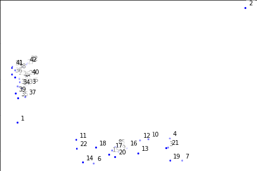
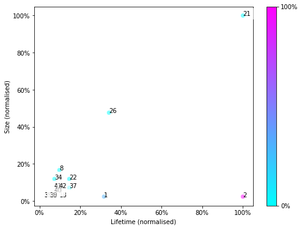

# MKNN Homology
A small Python library which implements an outlier detector based on persistent homology. 

## Usage
You can import the module as
```python
import mknn
```
This will give you access to the main class, `Filtration`. If you have already
parsed your data into an array of shape `(N,d)`, where `N` is the number of points and `d` the dimension of the ambient space, then you can construct a `Filtration` instance like so
```python
filt = mknn.Filtration(data = data)
```

## Example
You can find an example case [here](example/example_data.csv). This file
contains 42 points in two dimensions. The dataset has two main clusters and two
outliers,

.

The two outliers are the points labeled 1 and 2. 

To run the detector on this set, first you should store the data in a `numpy` array as follows
```python
import numpy as np
data = np.genfromtxt("example_data.csv")
```
Then, you build a `Filtration` instance:
```python
import mknn
filt = mknn.Filtration(data = data)
```
Next, instruct the `Filtration` instance to compute its persistent homology
```python
filt.build_complex()
filt.compute_persistent_homology()
```
Finally, you can see the persistence plot by calling `plot_persistence` on
`filt`, which takes a string that will be used as the name of the file in which
the plot will be stored.
```python
filt.plot_persistence("persistence_example.png")
```

.


